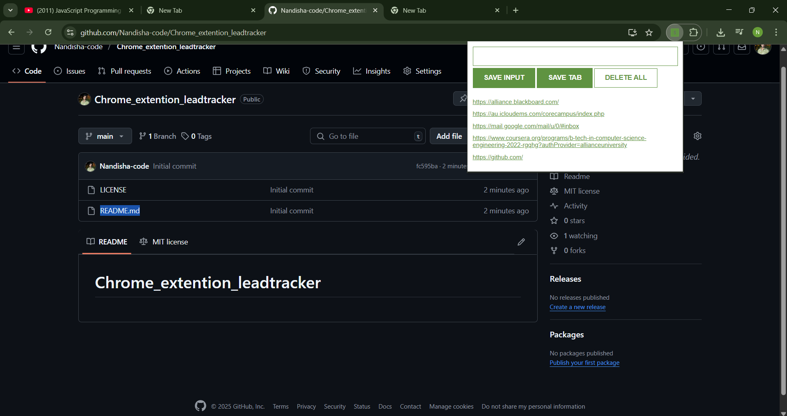

# 🔖 Lead Tracker - Chrome Extension

A simple and lightweight Chrome Extension to track and save web links manually or automatically from your current browser tab. Designed with minimal UI and built using vanilla JavaScript, HTML, and CSS.



## 🚀 Features

- ✅ Save inputted URLs manually via the "SAVE INPUT" button
- ✅ Save the currently active tab's URL with the "SAVE TAB" button
- 🗑️ Delete all saved URLs instantly with "DELETE ALL"
- 💾 Persistent storage using `localStorage` for retaining links across browser sessions
- 🎨 Clean and responsive UI with custom styles

## 📁 Project Structure

```plaintext
CHROME_EXTENSION/
├── icon.png             # Extension icon
├── index.html           # Popup UI layout
├── index.css            # Styles for the popup
├── index.js             # Core logic for saving, deleting, and rendering links
├── manifest.json        # Chrome extension manifest file
└── image.png            # Screenshot/preview of the extension

📌 License
This project is licensed under the MIT License.